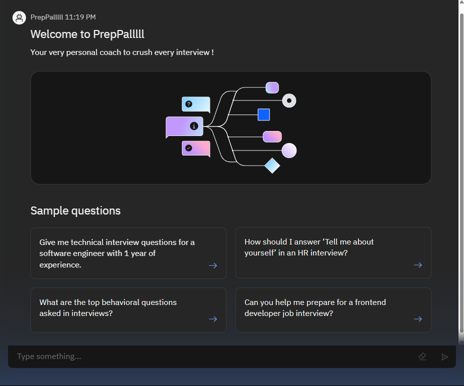
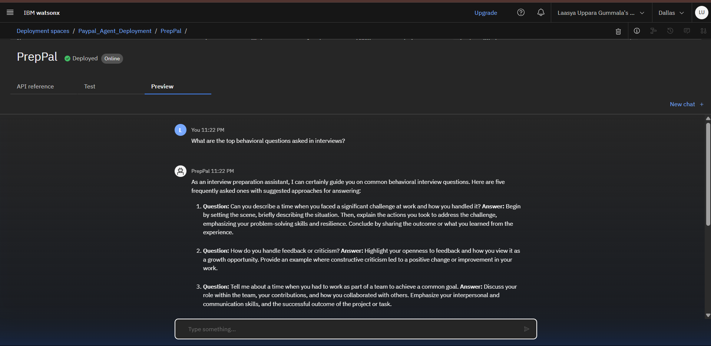

# PrepPal – Your Personal AI Interview Trainer
PrepPal is an AI-powered interview training assistant developed using IBM Cloud’s watsonx.ai Studio, Granite foundation models, and Retrieval-Augmented Generation (RAG). It is designed to assist job seekers by generating tailored interview questions, constructive feedback, and personalized preparation strategies based on the user's role, experience level, and resume.

# Problem Statement
In the modern job market, preparing for interviews can be time-consuming, fragmented, and overwhelming. Candidates often struggle to find accurate, role-specific questions or structured guidance tailored to their unique profiles. PrepPal addresses this challenge by offering a personalized, AI-driven interview preparation experience focused solely on career readiness and job-specific practice.

# Key Features
🎯 Role-specific question generation based on job title and experience

📄 Resume-based customization for interview strategies

🧪 Mock interview simulations with real-time, actionable feedback

📚 Retrieval-Augmented Generation (RAG) using curated datasets

🧠 HR behavioral scenarios & soft-skill training

🔒 Domain-restricted agent (limited to job prep content only)

🧬 Powered by IBM Granite Foundation Model

☁️ Deployed on IBM Cloud watsonx.ai ecosystem

# How to Use PrepPal
1.  Launch the PrepPal Agent.

2.  Greet the assistant – it'll introduce itself and prompt you for your job role or resume details.

3.  Enter your role (e.g., “Software Engineer with 1 year of experience”).

4.  Choose your prep mode – mock interview, HR behavioral practice, technical Q&A, etc.

5.  Receive personalized questions, feedback, and tips tailored to your input.

6.  Refine your responses based on feedback, or generate new questions on demand.

# Example Prompts
Here are some examples to get started: 

“I am applying for a Frontend Developer role. Can you help me prepare?”

“Give me behavioral questions based on my resume.”

“Simulate a mock interview for a Data Analyst position.”

“What are some common HR round questions for freshers?”

# Agent Demo
### Home

### 💬 Chat Interface Demo

### 📑 Deployment Success

# Technologies Used
-> IBM Cloud Lite Services

-> IBM watsonx.ai Studio

-> IBM watsonx.ai Runtime

-> IBM Agent Lab

-> IBM Granite Foundation Model

-> Retrieval-Augmented Generation (RAG)

-> Natural Language Processing (NLP)

# Target Users
1. Final-year students and fresh graduates

2. Early-career professionals (1–3 years of experience)

3. Domain-specific job aspirants (e.g., technology, HR, design)

4. Career switchers and job market re-entrants

5. University placement cells, training centers, and EdTech platforms

# Acknowledgements
This project was created as part of the Edunet IBM SkillsBuild Academic Internship, powered by IBM Cloud watsonx.ai Studio and Agent Lab.

